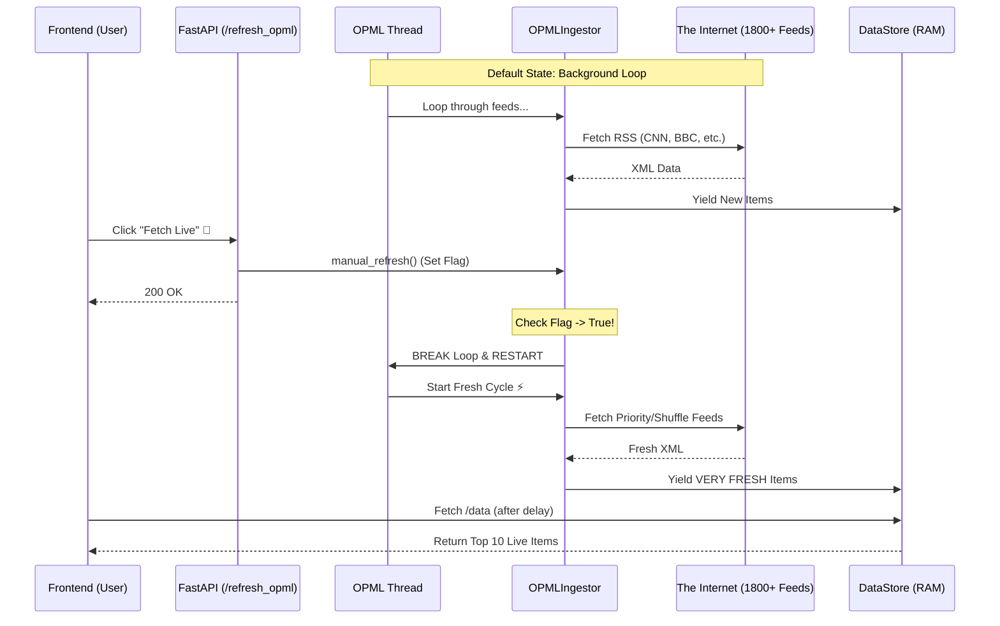

# ☢️ OPML "Nuclear Option" Architecture

**Live Social Analyst** uses a high-throughput ingestion engine designed to process **1800+ global RSS feeds** in real-time. This subsystem, colloquially known as the "Nuclear Option," ensures that the platform has access to a massive, uncensored stream of global information.

## 1. Core Components

The architecture consists of three main components interacting asynchronously:

1.  **`OPMLIngestor` Class (`ingest/opml_loader.py`)**:
    *   **Role**: The engine core. It downloads OPML lists (collections of RSS feeds) from GitHub, parses them, and manages the list of active feed URLs.
    *   **Behavior**: It runs an infinite loop that shuffles the feed list and fetches them sequentially (but rapidly) to avoid rate limits on any single server while maximizing throughput.
    *   **Real-Time Trigger**: It listens for a `force_restart` flag. When set, it immediately breaks the current loop and restarts the cycle, ensuring new data is fetched instantly.

2.  **Global Thread Manager (`app_pathway.py`)**:
    *   **Role**: Orchestrator. It instantiates a **Global Instance** of `OPMLIngestor` at startup.
    *   **Execution**: It spawns a dedicated daemon thread (`threading.Thread`) that runs the `opml_instance.run()` generator. This ensures the main web server remain responsive while the "Nuclear" engine churns in the background.

3.  **FASTApi Endpoint (`/refresh_opml`)**:
    *   **Role**: The Control Switch.
    *   **Action**: When the frontend "Fetch Live" button is clicked, this endpoint is hit. It calls `global_opml.manual_refresh()`, setting the interrupt flag on the engine.

## 2. Data Flow Diagram



## 3. Key Technical Decisions

*   **Global Instance Pattern**: Unlike standard request-scoped dependencies, the OPML engine must persist across requests to maintain its state (seen entries, current position in the 1800-list). We use a `global_opml` variable in `app_pathway.py` to achieve this.
*   **Generator-Based Ingestion**: The `run()` method yields items one by one. This allows the consumer (`run_connector`) to buffer and save items to the database efficiently without keeping thousands of objects in memory.
*   **Deduplication**: The engine maintains a `seen_entries` set to prevent flooding the system with duplicate articles from the same feed during short polling intervals.
*   **Shuffle Logic**: Feeds are shuffled on every cycle. This prevents the "Alphabetical Bias" where feeds starting with 'A' are always fresher than 'Z'.

## 4. Usage

The system runs automatically on startup. However, you can force a refresh via the API:

```bash
curl -X POST http://localhost:8000/refresh_opml
```

Or simply use the **"Fetch Live"** button on the frontend.
