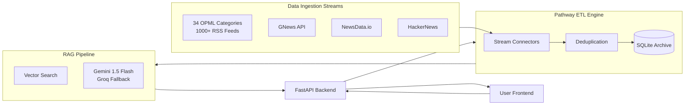
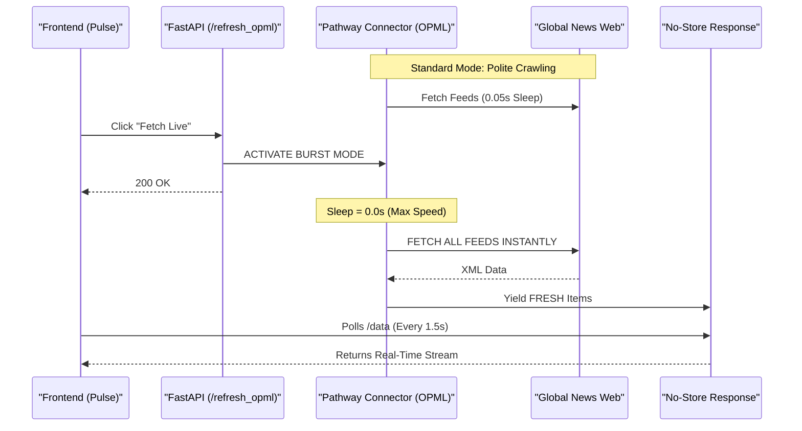

# Live Social Analyst | Real-Time Pathway ETL Intelligence

[](https://github.com/pathwaycom/pathway)
[](https://python.org)
[](https://fastapi.tiangolo.com)
[](https://groq.com)
[](https://deepmind.google/technologies/gemini/)

## 🚨 The Problem with Stale Knowledge
In the current landscape of artificial intelligence, many applications powered by Large Language Models (LLMs) are constrained by a fundamental limitation: **their knowledge is static**. Retrieval-Augmented Generation (RAG) systems, while powerful, often rely on a knowledge base that is a mere snapshot in time.

This creates a **"knowledge cutoff,"** where an AI assistant can become instantly obsolete. Imagine a financial chatbot unaware of a market-moving announcement made minutes ago, or a customer service bot providing information based on documentation that was updated yesterday. In a world that operates in real-time, **these delays are critical failures**.

## ⚡ The Paradigm Shift to "Live AI"
A new paradigm is emerging to address this challenge: **"Live AI."** This represents a fundamental shift from static, retrospective intelligence to dynamic systems that perceive, learn, and reason in real-time.

**Live Social Analyst** is perpetually synchronized with the latest version of reality, processing information as it is created, modified, or deleted. This project puts us at the forefront of this transformation.

## 🛠️ Powered by Pathway: The Engine for Live AI
The core technology driving this application is **Pathway**, a data processing framework designed specifically for building AI pipelines over **live data streams**.

It allows us to define complex AI workflows that process information **incrementally**, enabling extremely low-latency updates. Its unique architecture unifies batch and streaming data, meaning we can ingest thousands of global sources and instantly reflect them in our RAG pipeline without manual restarts or batch re-indexing.

---

## ⚙️ How It Works: The "Live AI" Pipeline

This application connects to a dynamic, continuously updating array of data sources and reflects the **absolute latest state of reality** in real-time.

1.  **Massive Real-Time Ingestion**:
    *   **1000+ RSS Feeds (OPML)**: Continuously scanning global news.
    *   **NewsData.io & GNews**: Integrating external news APIs.
    *   **HackerNews & Social Streams**: Monitoring tech & social discussions.

2.  **Zero-Latency Processing**:
    *   As soon as a news item is detected, it is **instantly streamed** into the Pathway engine.
    *   The engine deduplicates, normalizes, and embeds the text on-the-fly.
    *   New information is **immediately indexable** by the RAG system—no waiting for nightly batches.

3.  **Dynamic Context Retrieval**:
    *   When you ask a question ("What just happened in Tech?"), the RAG pipeline queries the **live index**.
    *   It retrieves context that may have been created **seconds ago**.
    *   The LLM generates an answer based on what is happening *right now*, not what happened yesterday.


## Pathway Features in this App
*   **Stateless and stateful transformations**: Pathway supports stateful transformations such as joins, windowing, and sorting.
*   **Consistency**: Pathway handles the time for you, making sure all your computations are consistent. In particular, Pathway manages late and out-of-order points.
*   **Scalable Rust engine**: With Pathway Rust engine, you are free from the usual limits imposed by Python.


### Architecture Diagram


## High-Throughput OPML Architecture

This subsystem ensures that the platform has access to a massive, uncensored stream of global information by processing **thousands of global RSS feeds** in real-time.

### Core Components
1.  **OPMLIngestor Class**:
    *   **Role**: The engine core. Downloads massive OPML lists and manages feed URLs.
    *   **Firehose Injection**: Prioritizes high-frequency feeds (BBC, CNN, Reuters) at the start of every cycle.
    *   **Burst Mode**: Switches from "polite crawler" to "zero-sleep ingestion" mode upon manual trigger to ingest the entire stream instantly.

2.  **Global Thread Manager**:
    *   **Role**: Instantiates a Global Instance of the ingestor at startup to maintain state.

### OPML Data Flow Diagram


---

## Installation & Usage

Follow these steps to deploy the system locally.

### 1. Prerequisites
*   **Python**: Version 3.10 or higher.
*   **API Keys**: You need keys for:
    *   **Gemini** (Google AI)
    *   **Groq** (Llama 3 Inference)
    *   **GNews** (Historical Data)

### 2. Configuration
1.  Clone the repository:
    ```bash
    git clone https://github.com/your-repo/LiveSocialAnalyst.git
    cd LiveSocialAnalyst
    ```
2.  Create a `.env` file (or update `config.yaml`) with your credentials:
    ```env
    GEMINI_API_KEY=your_key_here
    GROQ_API_KEY=your_key_here
    GNEWS_API_KEY=your_key_here
    ```

### 3. Install Dependencies
Install the required Python packages:
```bash
pip install -r requirements.txt
```

### 4. Execution
Run the main application script. This initializes the FastAPI server and spawns the background Pathway daemon threads.

```bash
python3 app_pathway.py
```
*Expected Output*:
> `INFO: Uvicorn running on http://0.0.0.0:8000`
> `🚀 OPML: Starting to parse 2000+ RSS feeds...`
> `🔥 Injected 10 High-Frequency Firehose Feeds.`

---

## API Endpoints Reference

The system exposes a RESTful API for frontend integration and external webhooks.

| Method | Endpoint | Description | Payload / Params |
| :--- | :--- | :--- | :--- |
| `GET` | `/` | Landing Page | None |
| `GET` | `/app` | Main Dashboard Application | None |
| `GET` | `/data` | Fetch current engine stats and real-time buffer (No-Cache) | None |
| `POST` | `/fetch_news` | Get categorical news (Business, Tech, etc.) | `{"category": "business"}` |
| `POST` | `/query` | Perform RAG Analysis (Search) | `{"query": "Trump"}` |
| `POST` | `/refresh_opml` | **Burst Signal**: Triggers "Firehose" instant ingestion | None |

---

## Project Structure

A clean, modular architecture designed for scalability.

```
LiveSocialAnalyst/
├── app_pathway.py         # MAIN ENTRY POINT: Server & Thread Orchestrator
├── config.yaml            # Global Configuration
├── requirements.txt       # Dependency List
├── .env                   # Secrets (GitIgnored)
│
├── ingest/                # PATHWAY CONNECTORS (Data Ingestion)
│   ├── opml_loader.py     # High-Throughput Burst Ingestor
│   ├── gnews_connector.py
│   ├── firecrawl_connector.py
│   ├── reddit_stream.py
│   └── hackernews_stream.py
│
├── pipeline/              # INTELLIGENCE LAYER
│   └── gemini_rag.py      # Hybrid RAG & LLM Logic
│
├── frontend/              # PRESENTATION LAYER
│   ├── index.html         # Main SPA Real-Time Dashboard
│   └── assets/
│
└── data/                  # PERSISTENCE LAYER
    ├── database.py        # SQLite Interface
    └── storage/           # Local vector stores
```

---

## License
MIT License. Built for High-Performance Data Engineering.
