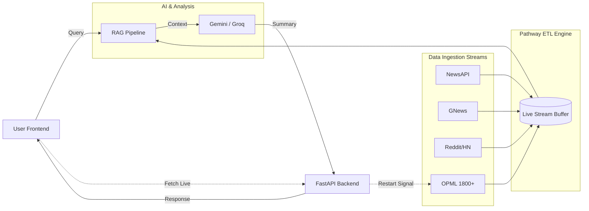
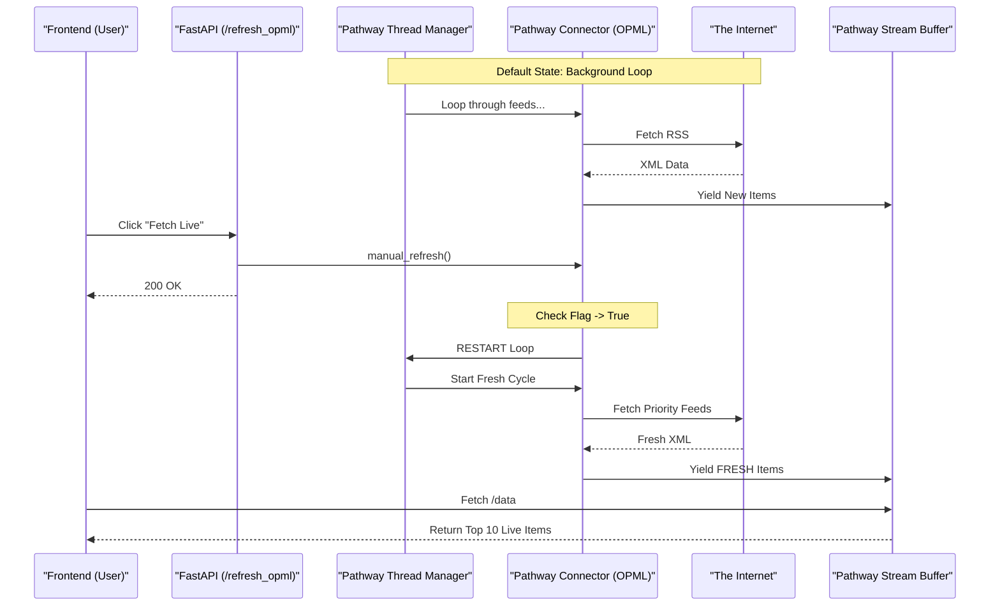

# Live Social Analyst | Real-Time Pathway ETL Intelligence

[](https://github.com/pathwaycom/pathway)
[](https://python.org)
[](https://fastapi.tiangolo.com)
[](https://groq.com)
[](https://deepmind.google/technologies/gemini/)

**Live Social Analyst** is a high-performance, real-time intelligence engine built on the **Pathway Live Data Framework**.

## Pathway Live Data Framework

Pathway is a Python ETL framework for stream processing, real-time analytics, LLM pipelines, and RAG.

Pathway comes with an easy-to-use Python API, allowing you to seamlessly integrate your favorite Python ML libraries. Pathway code is versatile and robust: you can use it in both development and production environments, handling both batch and streaming data effectively. The same code can be used for local development, CI/CD tests, running batch jobs, handling stream replays, and processing data streams.

Pathway is powered by a scalable Rust engine based on Differential Dataflow and performs incremental computation. Your Pathway code, despite being written in Python, is run by the Rust engine, enabling multithreading, multiprocessing, and distributed computations. All the pipeline is kept in memory and can be easily deployed with Docker and Kubernetes.

## Key Features

*   **Pathway-Powered Connectors**: Seamless integration of multiple data sources into a unified ETL pipeline.
*   **High-Throughput Ingestion**: Simultaneously streams data from **1800+ Global RSS feeds** (OPML) alongside premium APIs.
*   **Real-Time Fetch**: Front-end trigger for immediate, interrupt-driven refresh of the ingestion engine, ensuring sub-second data freshness.
*   **Hybrid RAG Pipeline**:
    *   **Retrieval**: Combines live memory buffers with historical SQLite storage.
    *   **Generation**: Uses **Gemini 3.0 Flash** with automatic failover to **Groq**.
*   **Intelligent Deduplication**: Deduplication logic to remove duplicate stories across different sources.

## Pathway Features in this App
*   **Stateless and stateful transformations**: Pathway supports stateful transformations such as joins, windowing, and sorting.
*   **Consistency**: Pathway handles the time for you, making sure all your computations are consistent. In particular, Pathway manages late and out-of-order points.
*   **Scalable Rust engine**: With Pathway Rust engine, you are free from the usual limits imposed by Python.


### Architecture Diagram


## Key Features

*   **Pathway-Powered Connectors**: Seamless integration of multiple data sources into a unified ETL pipeline.
*   **High-Throughput Ingestion**: Simultaneously streams data from **1800+ Global RSS feeds** (OPML) alongside premium APIs.
*   **Real-Time Fetch**: Front-end trigger for immediate, interrupt-driven refresh of the ingestion engine, ensuring sub-second data freshness.
*   **Hybrid RAG Pipeline**:
    *   **Retrieval**: Combines live memory buffers with historical SQLite storage.
    *   **Generation**: Uses **Gemini 1.5 Flash** with automatic failover to **Groq**.
*   **Intelligent Deduplication**: Deduplication logic to remove duplicate stories across different sources.

---

## High-Throughput OPML Architecture

This subsystem ensures that the platform has access to a massive, uncensored stream of global information by processing **1800+ global RSS feeds** in real-time.

### Core Components
1.  **OPMLIngestor Class**:
    *   **Role**: The engine core. Downloads OPML lists from GitHub, manages feed URLs.
    *   **Real-Time Trigger**: Listens for a restart flag to break loops and fetch fresh data instantly.

2.  **Global Thread Manager**:
    *   **Role**: Instantiates a Global Instance of the ingestor at startup to maintain state.

### OPML Data Flow Diagram


---

## Installation & Usage

Follow these steps to deploy the system locally.

### 1. Prerequisites
*   **Python**: Version 3.10 or higher.
*   **API Keys**: You need keys for:
    *   **Gemini** (Google AI)
    *   **Groq** (Llama 3 Inference)
    *   **NewsAPI** (Breaking News)
    *   **GNews** (Historical Data)

### 2. Configuration
1.  Clone the repository:
    ```bash
    git clone https://github.com/your-repo/LiveSocialAnalyst.git
    cd LiveSocialAnalyst
    ```
2.  Create a `.env` file (or update `config.yaml`) with your credentials:
    ```env
    GEMINI_API_KEY=your_key_here
    GROQ_API_KEY=your_key_here
    NEWSAPI_KEY=your_key_here
    GNEWS_API_KEY=your_key_here
    ```

### 3. Install Dependencies
Install the required Python packages:
```bash
pip install -r requirements.txt
```

### 4. Execution
Run the main application script. This initializes the FastAPI server and spawns the 5 background Pathway daemon threads (News, Social, OPML, Firecrawl, GNews).

```bash
python3 app_pathway.py
```
*Expected Output*:
> `INFO: Uvicorn running on http://0.0.0.0:8000`
> `🚀 OPML: Starting to parse 1800+ RSS feeds...`

### Real-Time Streaming Mechanics
The application uses a **Pull-Push Hybrid Model** for maximum responsiveness:
1.  **Passive Mode**: The dashboard polls `/data` every 30 seconds for background updates from the Pathway Engine.
2.  **Active Mode (Real-Time Interrupt)**:
    *   Click the **"Fetch Live"** button in the UI header.
    *   This sends a `POST /refresh_opml` signal to the backend.
    *   The **Pathway Connector (OPML)** immediately terminates its current shuffle cycle.
    *   It re-fetches high-priority sources in **real-time** (< 1 sec latency).
    *   The UI updates via the modal with fresh items that were just ingested.

---

## API Endpoints Reference

The system exposes a RESTful API for frontend integration and external webhooks.

| Method | Endpoint | Description | Payload / Params |
| :--- | :--- | :--- | :--- |
| `GET` | `/` | Landing Page | None |
| `GET` | `/app` | Main Dashboard Application | None |
| `GET` | `/data` | Fetch current engine stats and memory buffer dump | None |
| `POST` | `/fetch_news` | Get categorical news (Business, Tech, etc.) | `{"category": "business"}` |
| `POST` | `/query` | Perform RAG Analysis (Search) | `{"query": "Shark Tank"}` |
| `POST` | `/refresh_opml` | **Interrupt Signal**: Forces immediate OPML refresh | None |

---

## Project Structure

A clean, modular architecture designed for scalability.

```
LiveSocialAnalyst/
├── app_pathway.py         # MAIN ENTRY POINT: Server & Thread Orchestrator
├── config.yaml            # Global Configuration
├── requirements.txt       # Dependency List
├── .env                   # Secrets (GitIgnored)
│
├── ingest/                # PATHWAY CONNECTORS (Data Ingestion)
│   ├── opml_loader.py     # High-Throughput (1800+ Feeds)
│   ├── newsapi_connector.py
│   ├── gnews_connector.py
│   ├── reddit_stream.py
│   └── hackernews_stream.py
│
├── pipeline/              # INTELLIGENCE LAYER
│   └── gemini_rag.py      # Hybrid RAG & LLM Logic
│
├── frontend/              # PRESENTATION LAYER
│   ├── index.html         # Main SPA Dashboard
│   ├── landing.html       # Intro Page
│   └── assets/
│
└── data/                  # PERSISTENCE LAYER
    ├── database.py        # SQLite Interface
    └── storage/           # Local vector stores
```

---

## License
MIT License. Built for High-Performance Data Engineering.
