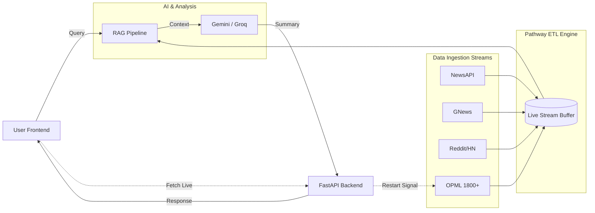
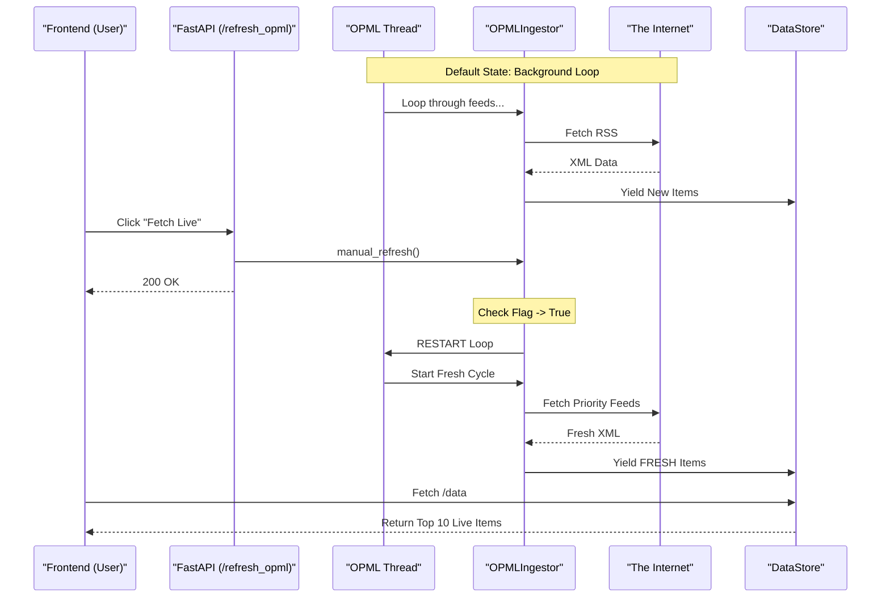

# Live Social Analyst | Real-Time Pathway ETL Intelligence

[](https://github.com/pathwaycom/pathway)
[](https://python.org)
[](https://fastapi.tiangolo.com)
[](https://groq.com)
[](https://deepmind.google/technologies/gemini/)

**Live Social Analyst** is a real-time intelligence engine built on the **Pathway Live Data Framework**. It aggregates, deduplicates, and analyzes global information streams instantly using Pathway's reactive data processing capabilities. It combines a massive ingestion network with a Hybrid RAG (Retrieval-Augmented Generation) pipeline to answer complex queries with verifiable sources.

## Pathway ETL Architecture

The core of the application is a **Pathway ETL Pipeline** that unifies diverse data streams into a single reliable source of truth. Unlike traditional batch processing, Pathway enables:

*   **Unified Streaming**: All data sources (NewsAPI, GNews, Reddit, OPML) are treated as continuous streams.
*   **Real-Time Reactivity**: The system updates its state immediately upon receiving new data points.
*   **In-Memory Processing**: Leveraging Pathway's high-performance engine for sub-second latency.

### Architecture Diagram


## Key Features

*   **Pathway-Powered Connectors**: Seamless integration of multiple data sources into a unified ETL pipeline.
*   **High-Throughput Ingestion**: Simultaneously streams data from **1800+ Global RSS feeds** (OPML) alongside premium APIs.
*   **Real-Time Fetch**: Front-end trigger for immediate, interrupt-driven refresh of the ingestion engine, ensuring sub-second data freshness.
*   **Hybrid RAG Pipeline**:
    *   **Retrieval**: Combines live memory buffers with historical SQLite storage.
    *   **Generation**: Uses **Gemini 1.5 Flash** with automatic failover to **Groq**.
*   **Intelligent Deduplication**: Deduplication logic to remove duplicate stories across different sources.

---

## High-Throughput OPML Architecture

This subsystem ensures that the platform has access to a massive, uncensored stream of global information by processing **1800+ global RSS feeds** in real-time.

### Core Components
1.  **OPMLIngestor Class**:
    *   **Role**: The engine core. Downloads OPML lists from GitHub, manages feed URLs.
    *   **Real-Time Trigger**: Listens for a restart flag to break loops and fetch fresh data instantly.

2.  **Global Thread Manager**:
    *   **Role**: Instantiates a Global Instance of the ingestor at startup to maintain state.

### OPML Data Flow Diagram


---

## Installation & Usage

### Prerequisites
*   Python 3.10+
*   API Keys: Gemini, Groq, NewsAPI, GNews (configured in `.env` and `config.yaml`).

### 1. Setup
```bash
# Install dependencies
pip install -r requirements.txt
```

### 2. Run the Backend
```bash
# Starts FastAPI server on port 8000
python3 app_pathway.py
```

### 3. Access the Frontend
Open `frontend/index.html` in your browser, or visit: `http://localhost:8000/app`

### 4. How to Use
1.  **View Feed**: The main page shows a Bento grid of top news.
2.  **Filter Topics**: Click "Business", "Tech", etc.
3.  **Fetch Live**: Click the button in the header.
    *   *Action*: Forces restart of OPML scanning.
    *   *Result*: Modal with latest 10 items.
4.  **Ask AI**: Use the search bar for queries.

---

## Project Structure

*   `app_pathway.py`: Main entry point and Pathway configuration.
*   `ingest/`: Connector modules.
*   `pipeline/`: RAG logic and LLM integration.
*   `frontend/`: Static HTML/JS UI.
*   `data/`: SQLite database and local caches.

---

## License
MIT License.
