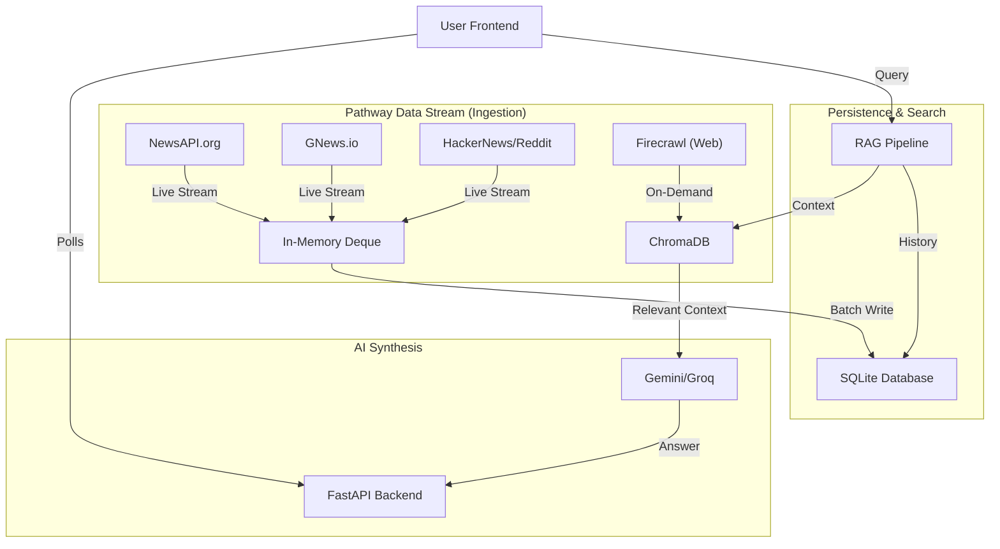

# Live Social Analyst

**Live Social Analyst** is a high-performance, hybrid RAG (Retrieval-Augmented Generation) engine that aggregates real-time news, social media streams, and historical data to provide instant, context-aware intelligence.

## System Architecture

The system is architected around the **Pathway Data Stream**, a high-throughput ingestion layer that enables the system to process live information with sub-second latency while maintaining deep historical context.

### Architecture Diagram


### 1. Pathway Data Stream (Ingestion Layer)
The Pathway Data Stream acts as the central nervous system for data, managing parallel ingestion pipelines from diverse high-velocity sources:
- **NewsAPI Streams**: Captures global breaking news and specific topic streams (e.g., "Fun/Viral" stream) in real-time.
- **GNews Historical Bridge**: Provides on-demand access to a 3-year archive for deep context on geopolitical and economic queries.
- **Social Firehose**: Ingests rapid-fire sentiment data from Reddit and HackerNews.
- **Firecrawl Targeted Scraper**: Executes precision deep-web scraping for specific URLs or semantic targets.

All incoming data is normalized instantaneously into a unified schema within the Pathway Data Stream before being routed to the storage layer.

### 2. Hybrid Data Storage
The architecture utilizes a tiered storage strategy to optimize for both freshness and persistence:
- **Hot Storage (In-Memory)**: The Live Stream buffer holds the most recent data points in memory for immediate access by the RAG engine.
- **Cold Storage (SQLite)**: High-value articles and historical search results are persisted to a relational database for long-term trend analysis and auditability.

### 3. The Hybrid RAG Pipeline
Every user query triggers a sophisticated retrieval pipeline designed to maximize relevance and accuracy:

#### A. Vector Embedding & Indexing
Incoming items from the Pathway Data Stream are embedded using `sentence-transformers/all-MiniLM-L6-v2`, creating a 384-dimensional vector representation. These vectors are indexed in **ChromaDB (In-Memory)**, enabling semantic search capabilities that go beyond simple keyword matching.

#### B. Context Construction Algorithm
The RAG engine constructs the context window for the LLM using a multi-factor ranking algorithm:
1.  **Freshness Filter**: Prioritizes live data items (less than 5 minutes old) for real-time queries.
2.  **Semantic Vector Search**: Retrieves items that are conceptually related to the query, even without exact keyword matches.
3.  **Keyword Boosting**: Ensures items with exact name matches are included to prevent hallucination.
4.  **Fallback Mechanism**: Automatically triggers secondary data providers (e.g., NewsAPI fallback) if primary historical sources yield insufficient data.

### 4. LLM Synthesis
The constructed context is processed by **Gemini 1.5 Pro** (or **Llama 3 via Groq**) to generate the final intelligence output. The LLM synthesizes the retrieval set into an Executive Summary and verified Key Findings, citing specific sources from the data stream.

---

## App Previews

### Landing Page
A minimalist entry point featuring a 3D data visualization and architectural overview.


### The Dashboard
The main interface featuring the real-time Pathway Data Stream and Bento-grid layout.


### Intelligent Search
The Hybrid RAG analysis view showing synthesized intelligence and reliability scoring.


---

## Getting Started

### Prerequisites
- Python 3.10+
- API Keys: `GEMINI_API_KEY`, `NEWSAPI_KEY`, `GNEWS_API_KEY`

### Installation
```bash
# Clone the repository
git clone https://github.com/YourRepo/LiveSocialAnalyst.git

# Install dependencies
pip install -r requirements.txt
```

### Running the Application
```bash
# Start the FastAPI server (Backend + Frontend)
python app_pathway.py
```
Access the application at `http://localhost:8000/`.

---

## Real-Time Streaming Functionality (Powered by Pathway)

This application is built on top of the **[Pathway](https://github.com/pathwaycom/pathway) Live Data Framework**, a Python ETL framework for stream processing, real-time analytics, and RAG pipelines. Pathway's Rust-powered engine provides the high-performance backbone for our data ingestion.

### 1. Pathway `ConnectorSubject` Architecture
Each data source is implemented as a **Pathway Connector** by extending `pw.io.python.ConnectorSubject`. This allows us to define data streams as Python generators that Pathway's engine consumes:

```python
# Example from ingest/newsapi_connector.py
import pathway as pw

class NewsApiConnector(pw.io.python.ConnectorSubject):
    def run(self):
        while True:
            # ... fetch from API ...
            yield {
                "source": "newsapi",
                "text": article.get('title'),
                "url": link,
                # ...
            }
            time.sleep(900) # Poll interval
```

This design enables:
-   **Incremental Computation**: Pathway's differential dataflow engine processes only new or changed data, not the entire dataset.
-   **Scalability**: The underlying Rust engine supports multithreading, multiprocessing, and distributed computation, breaking free from Python's GIL limitations.
-   **Unified Batch/Stream**: The same Pathway code can read static files or live streams, making development and testing seamless.

### 2. Live Data Stream Architecture
All connectors (NewsAPI, GNews, HackerNews, Reddit, Firecrawl) run as continuous Pathway streams, feeding into a shared in-memory buffer:
-   **In-Memory Deque**: A thread-safe `collections.deque` acts as the "hot storage," holding the latest ~200 items for instant O(1) access by the RAG engine.
-   **Batch Persistence**: Items are periodically flushed to SQLite ("cold storage") for historical analysis.

### 3. Frontend Polling & Caching
-   **`/data` Endpoint**: The frontend polls this endpoint every 60 seconds to refresh the "Global Pulse" sidebar with the latest items from the Pathway stream.
-   **`/fetch_news` Endpoint**: On-demand category fetches are cached in browser `localStorage` for an instant, app-like experience.

### Why Pathway?
-   **Python-Native, Rust-Powered**: Write simple Python, get C-level performance.
-   **Built for RAG**: Native support for LLM pipelines, vector indexing, and real-time document processing.
-   **Production-Ready**: Designed for deployment with Docker and Kubernetes, with built-in monitoring dashboards.

---

## Tech Stack
- **Backend Frameowrk**: FastAPI
- **Language**: Python 3.11
- **LLM Orchestration**: Google Gemini, Groq (Llama 3)
- **Vector Database**: ChromaDB
- **Embeddings**: Sentence-Transformers
- **Frontend**: Native JS, HTML5, CSS Variables
