# Live Social Analyst | 24/7 Real-Time Intelligence

[](https://python.org)
[](https://fastapi.tiangolo.com)
[](https://groq.com)
[](https://deepmind.google/technologies/gemini/)

**Live Social Analyst** is a high-performance, real-time intelligence engine designed to aggregate, deduplicate, and analyze global information streams instantly. It combines a massive ingestion network (1800+ RSS feeds, NewsAPI, GNews, Reddit, HackerNews) with a Hybrid RAG (Retrieval-Augmented Generation) pipeline to answer complex queries like "What is happening with Shark Tank right now?" with verifiable sources.

## 🚀 Key Features

*   **☢️ "Nuclear Option" Ingestion**: Simultaneously streams data from **1800+ Global RSS feeds** (OPML) alongside premium APIs.
*   **🔴 Real-Time "Fetch Live"**: Front-end button triggers an immediate, interrupt-driven refresh of the backend engine, ensuring sub-second data freshness.
*   **🧠 Hybrid RAG Pipeline**:
    *   **Retrieval**: Combines live memory buffers (Hot) with historical SQLite storage (Cold).
    *   **Generation**: Uses **Gemini 1.5 Flash** with automatic failover to **Groq (Llama 3)** for resilience.
*   **🛡️ Intelligent Deduplication**: Filter logic removes duplicate stories across different sources to keep the feed clean.
*   **🏷️ Topic isolation**: Strict category filtering allows users to isolate streams without noise.

---

## 🏗️ System Architecture

The system uses a **Multithreaded Producer-Consumer Architecture** to handle high-velocity data without blocking the API.

### Architecture Diagram
```mermaid
graph TD
    User[User Frontend] -->|Polls/Fetch| API[FastAPI Backend]
    User -->|Query Shark Tank| RAG[Analysis Pipeline]

    subgraph "Ingestion Engine (Daemon Threads)"
        NewsAPI[NewsAPI.org] -->|Thread 1| Buffer[Live Memory Deque]
        GNews[GNews.io] -->|Thread 2| Buffer
        Social["Reddit/HN"] -->|Thread 3| Buffer
        OPML["OPML Nuclear (1800+)"] -->|Thread 4 (Global)| Buffer
    end

    subgraph "Control Plane"
        User -->|Click Fetch Live| RefreshEP[/refresh_opml]
        RefreshEP -->|Signal| OPML
        OPML -->|Force Restart| Web[The Internet]
    end

    subgraph "AI Synthesis"
        Buffer -->|Context| LLM["Gemini / Groq"]
        LLM -->|Summary| API
    end
```

### 1. Ingestion Layer
Instead of relying on heavy external frameworks, we implemented a custom **Python Threading** engine. Each connector (News, Social, OPML) runs in its own daemon thread, fetching data and pushing it to a thread-safe `deque`.

### 2. RAG & AI Layer
*   **Model A (Primary)**: Gemini 1.5 Flash (Google) - Fast, large context.
*   **Model B (Fallback)**: Groq (Llama 3.3 70B) - Ultra-low latency inference.

---

## ☢️ OPML "Nuclear Option" Architecture

This subsystem ensures that the platform has access to a massive, uncensored stream of global information by processing **1800+ global RSS feeds** in real-time.

### Core Components
1.  **`OPMLIngestor` Class (`ingest/opml_loader.py`)**:
    *   **Role**: The engine core. Downloads OPML lists from GitHub, manages feed URLs.
    *   **Real-Time Trigger**: Listens for a `force_restart` flag to break loops and fetch fresh data instantly.

2.  **Global Thread Manager (`app_pathway.py`)**:
    *   **Role**: Instantiates a **Global Instance** of `OPMLIngestor` at startup to maintain state.

### OPML Data Flow Diagram

```mermaid
sequenceDiagram
    participant User as Frontend (User)
    participant API as FastAPI (/refresh_opml)
    participant Thread as OPML Thread
    participant Engine as OPMLIngestor
    participant Web as The Internet (1800+ Feeds)
    participant Store as DataStore (RAM)

    Note over Thread, Web: Default State: Background Loop
    Thread->>Engine: Loop through feeds...
    Engine->>Web: Fetch RSS
    Web-->>Engine: XML Data
    Engine->>Store: Yield New Items

    User->>API: Click "Fetch Live" 🔴
    API->>Engine: manual_refresh() (Set Flag)
    API-->>User: 200 OK
    
    Note over Engine: Check Flag -> True!
    Engine->>Thread: BREAK Loop & RESTART
    
    Thread->>Engine: Start Fresh Cycle ⚡
    Engine->>Web: Fetch Priority Feeds
    Web-->>Engine: Fresh XML
    Engine->>Store: Yield VERY FRESH Items
    
    User->>Store: Fetch /data (after delay)
    Store-->>User: Return Top 10 Live Items
```


### Key Technical Decisions
*   **Generator-Based Ingestion**: The `run()` method yields items one by one.
*   **Deduplication**: Maintains a `seen_entries` set to prevent duplicates.
*   **Shuffle Logic**: Feeds are shuffled on every cycle to ensure variety.

---

## 🛠️ Installation & Usage

### Prerequisites
*   Python 3.10+
*   API Keys: Gemini, Groq, NewsAPI, GNews (configured in `.env` and `config.yaml`).

### 1. Setup
```bash
# Install dependencies
pip install -r requirements.txt
```

### 2. Run the Backend
```bash
# Starts FastAPI server on port 8000
python3 app_pathway.py
```

### 3. Access the Frontend
Open `frontend/index.html` in your browser, or visit: `http://localhost:8000/app`

### 4. How to Use
1.  **View Feed**: The main page shows a "Verge-style" Bento grid.
2.  **Filter Topics**: Click "Business", "Tech", etc.
3.  **🔴 Fetch Live**: Click the pink button in the header.
    *   *Action*: Forces backend restart of OPML scanning.
    *   *Result*: Modal with latest 10 items.
4.  **Ask AI**: Use the search bar (e.g., "Shark Tank").

---

## 📂 Project Structure

*   `app_pathway.py`: Main entry point, API, and Thread Manager.
*   `ingest/`: Connector modules (OPML, NewsAPI, Reddit, etc.).
*   `pipeline/`: RAG logic and LLM integration (`gemini_rag.py`).
*   `frontend/`: Static HTML/JS UI (`index.html`).
*   `data/`: SQLite database and local caches.

---

## 📜 License
MIT License.
